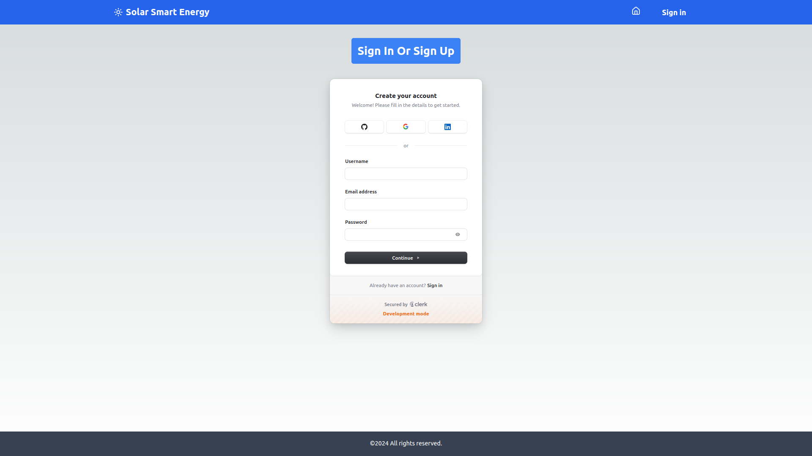

# Energy Optimization Platform

The Energy Optimization Platform is a web-based application focused on helping households and businesses with solar panels optimize their energy consumption. It uses time-of-use (ToU) or time-of-day (ToD) electricity tariffs to recommend strategies for maximizing savings by aligning energy usage with cheaper rates and utilizing solar energy during peak pricing periods.

## Deployment Link 
[https://energy-optimization-platform.vercel.app/]

## Table of Contents
- [Features](#features)
- [Technologies Used](#technologies-used)
- [Folder Structure](#folder-structure)
- [Installation](#installation)
- [Usage](#usage)
- [API Endpoints](#api-endpoints)
- [Data Models](#data-models)
- [Contributing](#contributing)
- [License](#license)

## Screenshots



## Features

- **Real-Time Tariff Monitoring**: Monitor current and forecasted electricity rates based on ToU or ToD tariffs.
- **Energy Consumption Analytics**: Analyze historical and real-time energy usage data.
- **Smart Scheduling**: Schedule household appliances for maximum cost efficiency.
- **Solar Energy Management**: Track and optimize the usage of solar energy.
- **Forecasting and Recommendations**: Receive insights and recommendations to help reduce energy costs.
- **Cost-Benefit Analysis**: Calculate potential savings based on energy consumption patterns.
- **Notifications**: Get alerts and notifications for important events and changes in energy rates.

## Technologies Used

- **Frontend**: Next.js (TypeScript), Tailwind CSS, Material UI.
- **Backend**: Next.js API routes with TypeScript, Mongoose, MongoDB.


## Installation

### Prerequisites

- **Node.js** and **npm** or **Yarn**
- **MongoDB** for the database

### Steps

1. Clone the repository:

    ```bash
    git clone https://github.com/your-username/energy-optimization-platform.git
    cd energy-optimization-platform
    ```

2. Install dependencies:

    ```bash
    npm install
    ```

3. Set up environment variables by creating a `.env.local` file in the root directory:

    ```plaintext
    MONGODB_URI=your_mongodb_connection_string
    ```

4. Start the development server:

    ```bash
    npm run dev
    ```

5. Access the application at `http://localhost:3000`.

## Usage

The platform allows users to view energy consumption analytics, receive recommendations, and manage energy usage efficiently. Key components include:

- **Tariff Monitor**: Shows current and upcoming tariff rates.
- **Energy Consumption**: Displays consumption analytics and cost-benefit analysis.
- **Smart Scheduling**: Allows scheduling appliances based on tariffs.
- **Notifications**: Provides alerts on significant events.

## API Endpoints

The following API endpoints are available for managing and retrieving data:

- **GET /api/tariff**: Retrieve current and forecasted tariff rates.
- **GET /api/consumption**: Fetch historical energy consumption data.
- **POST /api/scheduling**: Submit or update appliance schedules.
- **GET /api/notifications**: Get notifications for important alerts.

## Data Models

The primary data model used is the `City` model. Below is a brief overview:

### City Model

- **temperature**: Contains current temperature and forecast data.
- **weather**: Holds weather conditions such as humidity and wind speed.
- **tariffRates**: Stores current tariff rate and hourly forecasted rates.
- **peakHours**: Lists peak hours for energy usage.
- **notifications**: Array of alerts with type, timestamp, and severity.
- **hourlyDemand**: Stores hourly energy demand for historical and forecast data.

Refer to the `City` model in `models/City.ts` for complete details.

## Contributing

1. Fork the repository.
2. Create a new branch (`git checkout -b feature-branch`).
3. Commit your changes (`git commit -m "Add new feature"`).
4. Push the branch (`git push origin feature-branch`).
5. Open a pull request.

We welcome contributions! Please ensure your code follows the established code style and includes appropriate tests.

## License

This project is licensed under the MIT License. See the [LICENSE](LICENSE) file for more information.


